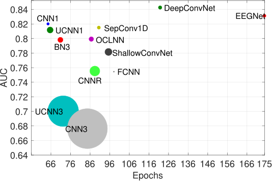

# Convolutional Neural Networks for P300 Detection
This repository evaluates different state-of-the-art CNN arquitectures for P300 detection in EEG signals and compares them in terms of detection performance and model complexity. 

## Datasets
The evaluation was done on the following datasets:

* [P300 Akimpech Database](https://akimpech.izt.uam.mx/p300db/p300db.html) ([LINI](https://akimpech.izt.uam.mx/))
* [BCI Competition II - Data set IIb](http://www.bbci.de/competition/ii/)
* [BCI Competition III - Data set II](http://www.bbci.de/competition/iii/)
* [BNCI Horizon 2020](http://bnci-horizon-2020.eu/database/data-sets)

## Requirements
* Python 3.7
* Tensorflow 1.14.0
* NumPy
* SciPy
* Pandas
* matplotlib
* scikit-learn
* cudatoolkit 10.0
* cudnn

You can create a [conda environment](https://www.anaconda.com/distribution/) with all the dependencies using the `environment.yml` file in this repository.

```
conda env create -n p300cnn -f environment.yml
```

## CNN Architectures
We evaluate the following state-of-the-art CNN architectures:

* CNN1 and CNN3 (as well as slight modifications of them)
  + Cecotti, H., & Graser, A. (2010). Convolutional neural networks for P300 detection with application to brain-computer interfaces. _IEEE transactions on pattern analysis and machine intelligence_, 33(3), 433-445.
* EEGNet (@vlawhern [implementation](https://github.com/vlawhern/arl-eegmodels))
  + Lawhern, V. J., Solon, A. J., Waytowich, N. R., Gordon, S. M., Hung, C. P., & Lance, B. J. (2018). EEGNet: a compact convolutional neural network for EEG-based brain–computer interfaces. _Journal of neural engineering_, 15(5), 056013.
* ShallowConvNet and DeepConvNet (@vlawhern [implementation](https://github.com/vlawhern/arl-eegmodels))
  + Schirrmeister, R. T., Springenberg, J. T., Fiederer, L. D. J., Glasstetter, M., Eggensperger, K., Tangermann, M., Hutter, F., Burgard, W., & Ball, T. (2017). Deep learning with convolutional neural networks for EEG decoding and visualization. _Human brain mapping_, 38(11), 5391-5420.
* OCLNN
  + Shan, H., Liu, Y., & Stefanov, T. P. (2018, July). A Simple Convolutional Neural Network for Accurate P300 Detection and Character Spelling in Brain Computer Interface. In Proceedings of the 27th International Joint Conference on Artificial Intelligence, Stockholm, Sweden, 13-19 July 2018, 1604-1610.
* BN$^3$
  + Liu, M., Wu, W., Gu, Z., Yu, Z., Qi, F., & Li, Y. (2018). Deep learning based on batch normalization for P300 signal detection. _Neurocomputing_, 275, 288-297.
* CNN-R
  + Manor, R., & Geva, A. B. (2015) Convolutional neural network for multi-category rapid serial visual presentation BCI. _Frontiers in computational neuroscience_, 9, 146.

We also propose and evaluate a simple CNN architecture inspired by OCLNN (SepConv1D) and a Fully-Connected Neural Network with a single hidden layer with two neurons (FCNN).

## Results 



## Reference
```
@Article{p300cnnt_2021,
  author = {Montserrat Alvarado-González and Gibran Fuentes-Pineda and Jorge Cervantes-Ojeda},
  title = {A few filters are enough: Convolutional neural network for P300 detection},
  journal = {Neurocomputing},
  volume = {425},
  pages = {37--52},
  year = {2021},
}
```